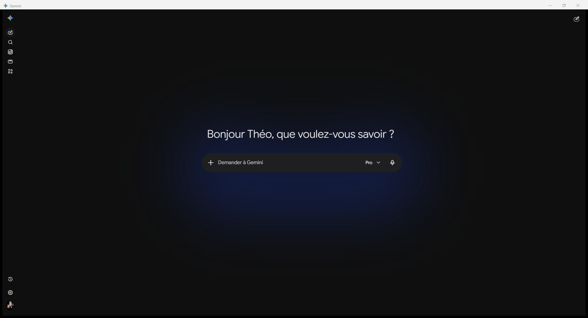
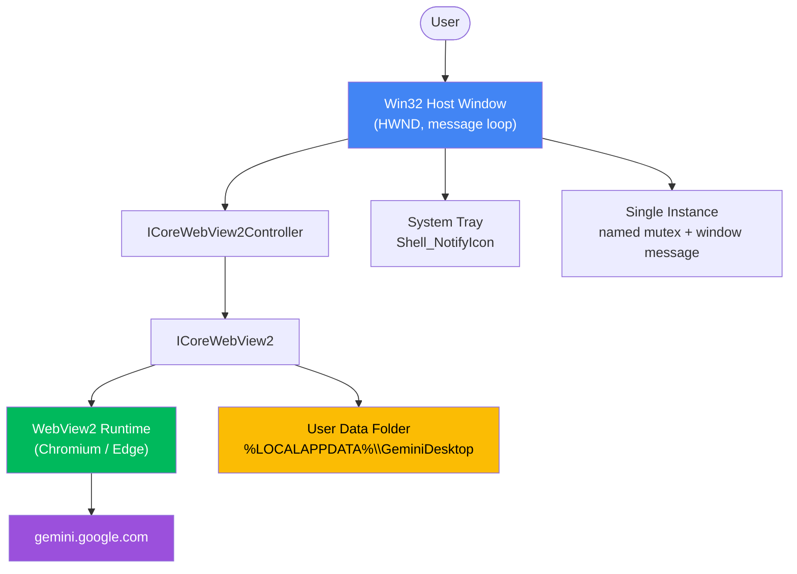
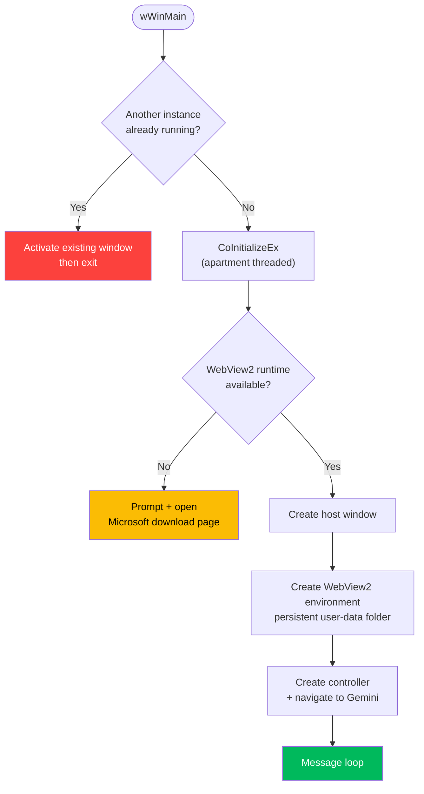

<div align="center">

# Gemini Desktop

**A Featherweight Native Windows Client for Google Gemini**

[](https://github.com/TheoEwzZer/gemini-desktop/releases/latest)
[](https://github.com/TheoEwzZer/gemini-desktop/releases)
[](https://isocpp.org)
[](https://www.microsoft.com/windows)
[](https://developer.microsoft.com/microsoft-edge/webview2/)
[](LICENSE)

**[⬇️ Download the latest release](https://github.com/TheoEwzZer/gemini-desktop/releases/latest)**

**[:fr: Version française disponible ici](README_FRENCH.md)**

_A minimal Win32 host that wraps `gemini.google.com` in a native window through the Microsoft Edge WebView2 runtime — a single ~270 KB executable with no bundled browser, persistent sessions, and system-tray integration._

</div>

<div align="center">



_The app running natively: signed-in session, model selector, and the Gemini spark icon in the title bar._

</div>

---

## Abstract

> Google Gemini ships no official desktop application for Windows. **Gemini Desktop** fills that gap with the lightest possible approach: instead of embedding an entire Chromium runtime (as Electron does) or layering a cross-platform framework on top of the system webview (as Tauri does), it is a pure **C++/Win32** host that drives the **WebView2** runtime already present on every up-to-date Windows 10/11 machine. The result is a genuinely app-like experience — persistent login, resizable HiDPI window, single-instance behavior, and minimize-to-tray — in a self-contained executable of roughly 270 KB with zero external DLLs.

### Key Features

- **Tiny footprint** — a single ~270 KB `.exe`, no bundled browser, no companion DLL (static WebView2 loader + static CRT).
- **Native window** — real Win32 window: resizable, DPI-aware (PerMonitorV2), custom Gemini icon.
- **Persistent sessions** — login and cookies survive restarts via a dedicated WebView2 user-data folder.
- **Single instance** — launching a second time re-focuses the running window instead of opening a duplicate.
- **System tray** — closing hides to the tray; a context menu offers _Show_ / _Quit_, with a first-run notice.
- **Launch at startup** — optional, toggled right from the tray menu; starts minimized to the tray on login.
- **Runtime awareness** — if the WebView2 runtime is missing, the app explains and links to the Microsoft download page.
- **Reproducible builds** — CMake + vcpkg manifest, one-command `build.bat`.

### Table of Contents

- [Installation](#installation)
- [Architecture](#architecture)
  - [Component Overview](#component-overview)
  - [Startup Flow](#startup-flow)
- [Why WebView2?](#why-webview2)
- [Project Structure](#project-structure)
- [Building from Source](#building-from-source)
  - [Prerequisites](#prerequisites)
  - [Build](#build)
  - [Run](#run)
- [Configuration](#configuration)
- [How It Works](#how-it-works)
- [Roadmap](#roadmap)
- [License](#license)
- [Acknowledgments](#acknowledgments)

---

## Installation

Grab the latest build from the **[Releases page](https://github.com/TheoEwzZer/gemini-desktop/releases/latest)** — two options:

### Option 1 — Installer (recommended)

Download **`GeminiDesktop-Setup.exe`** and run it. The wizard creates a Start-menu shortcut (and an optional desktop icon) and registers a clean uninstaller in _Add or remove programs_. If the WebView2 runtime is missing, the installer downloads Microsoft's official runtime and installs it automatically (an internet connection is required for that step; if it is unavailable, the installer points you to the manual download).

### Option 2 — Portable

Download **`GeminiDesktop.exe`** and double-click it — no installation, ~270 KB. Requires the [WebView2 runtime](https://developer.microsoft.com/microsoft-edge/webview2/) (already present on up-to-date Windows 10/11).

> **SmartScreen note:** the binaries are not code-signed yet, so Windows may show a _"Windows protected your PC"_ prompt on first run. Click **More info → Run anyway**.

Prefer to build it yourself? See [Building from Source](#building-from-source).

---

## Architecture

The application is a thin native shell around a single WebView2 control. All UI is rendered by Gemini itself; the host only manages the window, the tray, session storage, and process lifecycle.

### Component Overview



### Startup Flow



---

## Why WebView2?

The project deliberately chose the lightest viable technology. WebView2 and Tauri share the _same_ rendering engine on Windows (the Edge/Chromium runtime); the difference is everything wrapped around it.

| Criterion           | Electron         | Tauri                             | **Gemini Desktop (WebView2 + Win32)** |
| ------------------- | ---------------- | --------------------------------- | ------------------------------------- |
| Rendering engine    | Bundled Chromium | System WebView2                   | System WebView2                       |
| Installer size      | ~85–150 MB       | ~3–10 MB                          | **~270 KB**                           |
| Idle memory         | High             | Low                               | **Lowest**                            |
| Extra runtime layer | Node.js          | Rust + cross-platform abstraction | **None** (raw Win32)                  |
| External DLLs       | Many             | Few                               | **None**                              |
| Platform            | Cross-platform   | Cross-platform                    | Windows-only (by design)              |

Because the target is explicitly **Windows-only**, the cross-platform machinery of Electron and Tauri is dead weight — a raw Win32 host removes it entirely.

---

## Project Structure

```
gemini-desktop/
├── CMakeLists.txt          # Build config: x64 MSVC, UNICODE, static CRT (/MT)
├── CMakePresets.json       # "x64-release" preset (Visual Studio generator + vcpkg)
├── vcpkg.json              # Manifest: webview2, wil (pinned baseline)
├── build.bat               # One-command build (locates MSVC, runs CMake)
├── src/
│   ├── main.cpp            # wWinMain: single-instance, runtime check, message loop
│   ├── App.cpp / .hpp      # Host window + WebView2 + resize + tray orchestration
│   ├── SingleInstance.*    # Named mutex + activate-existing logic
│   ├── Tray.*              # Shell_NotifyIcon, context menu, balloon notice
│   ├── Paths.*             # %LOCALAPPDATA% resolution for the user-data folder
│   └── Constants.hpp       # Shared constants (URL, names, IDs)
├── res/
│   ├── app.rc              # Icon + version info + manifest resource
│   ├── app.manifest        # DPI PerMonitorV2, Windows 10/11 compatibility
│   └── icon.ico            # Official Gemini icon (multi-resolution)
└── assets/
    └── screenshot.png      # README hero image
```

---

## Building from Source

### Prerequisites

- **Windows 10 / 11 (x64)**
- **Visual Studio 2022** or **Build Tools 2022** with the _Desktop development with C++_ workload
- **CMake 3.21+**
- **[vcpkg](https://github.com/microsoft/vcpkg)** (clone + `bootstrap-vcpkg.bat`)
- **WebView2 Runtime** — preinstalled on up-to-date Windows 10/11

### Build

Set `VCPKG_ROOT` to your vcpkg checkout (or edit the default at the top of `build.bat`), then run:

```bat
build.bat
```

The script locates MSVC via the Visual Studio generator, resolves `webview2` + `wil` through vcpkg (the first run compiles them and may take a few minutes), and builds a Release binary.

Prefer to drive CMake directly?

```bat
set VCPKG_ROOT=C:\path\to\vcpkg
cmake --preset x64-release
cmake --build --preset x64-release
```

### Run

```
build\Release\GeminiDesktop.exe
```

Pin it to the taskbar or Start menu for quick access.

---

## Configuration

Common tweaks live in [`src/Constants.hpp`](src/Constants.hpp):

| Constant       | Purpose                                                 |
| -------------- | ------------------------------------------------------- |
| `kHomeUrl`     | The URL loaded on startup (`https://gemini.google.com`) |
| `kWindowTitle` | Window and tray title                                   |
| `kMutexName`   | Single-instance mutex name                              |
| `kRegistryKey` | `HKCU` key used to remember the first-run tray notice   |

Window default size lives in `App::Create` (`CreateWindowExW`), and the persistent storage location is built in [`src/Paths.cpp`](src/Paths.cpp).

---

## How It Works

<details>
<summary><strong>Persistent sessions</strong></summary>

The WebView2 environment is created with an explicit user-data folder at `%LOCALAPPDATA%\GeminiDesktop\WebView2`. Cookies, local storage, and the signed-in session are kept there, so you stay logged in across restarts — exactly like a dedicated app.

</details>

<details>
<summary><strong>Single instance</strong></summary>

A named mutex detects an already-running instance. The second process calls `AllowSetForegroundWindow`, broadcasts a registered window message so the live instance restores itself, and falls back to `FindWindow` + `SetForegroundWindow`. This combination sidesteps Windows' foreground-focus lock, which otherwise only flashes the taskbar button.

</details>

<details>
<summary><strong>Minimize to tray</strong></summary>

Closing the window hides it to the system tray rather than quitting. The tray icon offers a _Show_ / _Quit_ context menu; a left click toggles visibility. The first time the window hides, a balloon tip explains where it went (remembered via a registry flag so it only shows once).

</details>

<details>
<summary><strong>Launch at startup</strong></summary>

The tray context menu has a checkable **Launch at startup** entry. Toggling it writes (or removes) a per-user value under `HKCU\Software\Microsoft\Windows\CurrentVersion\Run` — no administrator rights needed. The registered command carries a `--startup` flag so that, at login, the app starts silently minimized in the tray instead of popping a window.

</details>

<details>
<summary><strong>Runtime detection</strong></summary>

On startup the app calls `GetAvailableCoreWebView2BrowserVersionString`. If the WebView2 runtime is missing, it shows a clear message and offers to open the official Microsoft download page instead of crashing.

</details>

---

## License

Released under the [MIT License](LICENSE).

---

## Acknowledgments

- **Google** for [Gemini](https://gemini.google.com) and the official Gemini icon.
- **Microsoft** for the [WebView2](https://developer.microsoft.com/microsoft-edge/webview2/) runtime and the [WIL](https://github.com/microsoft/wil) library.
- The **[vcpkg](https://github.com/microsoft/vcpkg)** team for painless native dependency management.
