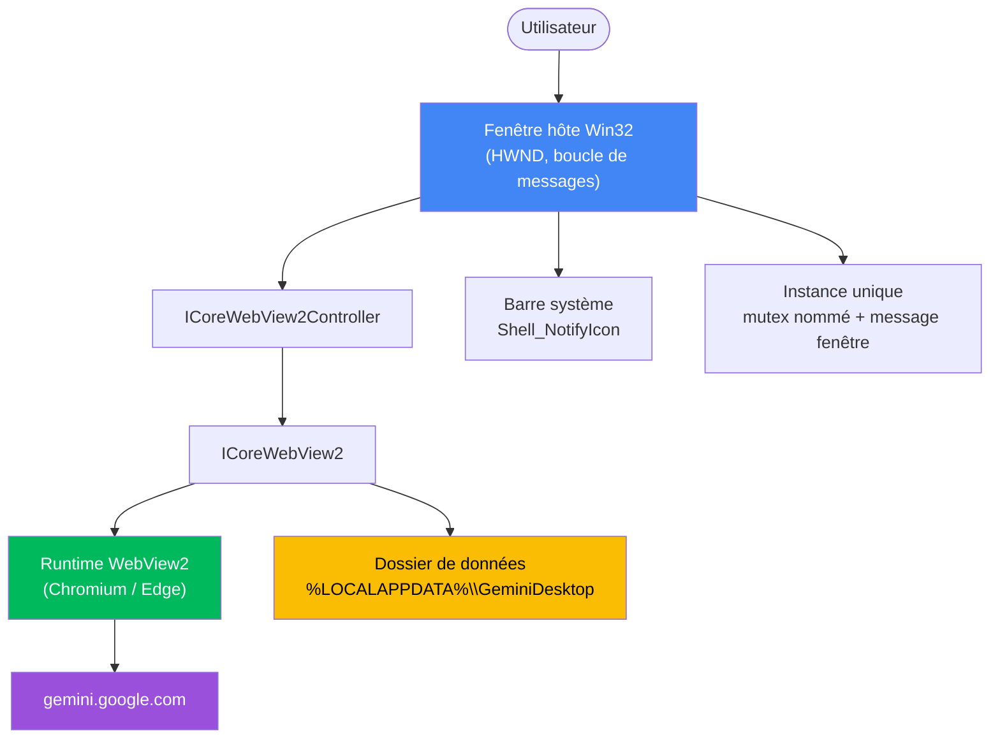
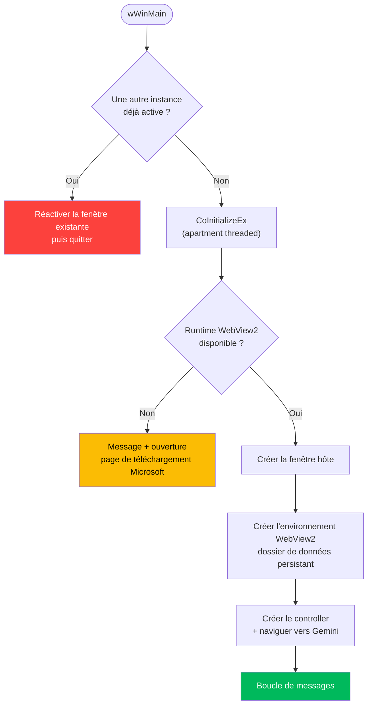

<div align="center">

# Gemini Desktop

**Un client Windows natif ultra-léger pour Google Gemini**

[](https://github.com/TheoEwzZer/gemini-desktop/releases/latest)
[](https://github.com/TheoEwzZer/gemini-desktop/releases)
[](https://isocpp.org)
[](https://www.microsoft.com/windows)
[](https://developer.microsoft.com/microsoft-edge/webview2/)
[](LICENSE)

**[⬇️ Télécharger la dernière version](https://github.com/TheoEwzZer/gemini-desktop/releases/latest)**

**[:gb: English version available here](README.md)**

_Un hôte Win32 minimal qui encapsule `gemini.google.com` dans une fenêtre native via le runtime Microsoft Edge WebView2 — un exécutable unique d'environ 270 Ko, sans navigateur embarqué, avec sessions persistantes et intégration à la barre système._

</div>

<div align="center">


_L'application en fonctionnement natif : session connectée, sélecteur de modèle et icône Gemini dans la barre de titre._

</div>

---

## Résumé

> Google Gemini ne propose aucune application de bureau officielle sous Windows. **Gemini Desktop** comble ce manque avec l'approche la plus légère possible : au lieu d'embarquer un runtime Chromium complet (comme Electron) ou d'empiler un framework multiplateforme au-dessus de la webview système (comme Tauri), c'est un hôte **C++/Win32** pur qui pilote le runtime **WebView2** déjà présent sur toute machine Windows 10/11 à jour. Le résultat est une véritable expérience « app » — connexion persistante, fenêtre redimensionnable et compatible HiDPI, instance unique, réduction dans la barre système — dans un exécutable autonome d'environ 270 Ko, sans aucune DLL externe.

### Fonctionnalités clés

- **Empreinte minuscule** — un seul `.exe` d'environ 270 Ko, sans navigateur embarqué ni DLL annexe (loader WebView2 statique + CRT statique).
- **Fenêtre native** — vraie fenêtre Win32 : redimensionnable, compatible DPI (PerMonitorV2), icône Gemini personnalisée.
- **Sessions persistantes** — connexion et cookies conservés entre les lancements grâce à un dossier de données WebView2 dédié.
- **Instance unique** — un second lancement réactive la fenêtre existante au lieu d'ouvrir un doublon.
- **Barre système** — la fermeture réduit dans le tray ; un menu contextuel propose _Afficher_ / _Quitter_, avec une notice au premier passage.
- **Démarrage avec Windows** — optionnel, activable directement depuis le menu du tray ; démarre réduit dans le tray à l'ouverture de session.
- **Détection du runtime** — si le runtime WebView2 est absent, l'application l'explique et redirige vers la page de téléchargement Microsoft.
- **Builds reproductibles** — CMake + manifeste vcpkg, un seul `build.bat`.

### Table des matières

- [Installation](#installation)
- [Architecture](#architecture)
  - [Vue d'ensemble des composants](#vue-densemble-des-composants)
  - [Séquence de démarrage](#séquence-de-démarrage)
- [Pourquoi WebView2 ?](#pourquoi-webview2-)
- [Structure du projet](#structure-du-projet)
- [Compilation depuis les sources](#compilation-depuis-les-sources)
  - [Prérequis](#prérequis)
  - [Compiler](#compiler)
  - [Lancer](#lancer)
- [Configuration](#configuration)
- [Fonctionnement interne](#fonctionnement-interne)
- [Feuille de route](#feuille-de-route)
- [Licence](#licence)
- [Remerciements](#remerciements)

---

## Installation

Récupérez la dernière version sur la **[page des Releases](https://github.com/TheoEwzZer/gemini-desktop/releases/latest)** — deux options :

### Option 1 — Installeur (recommandé)

Téléchargez **`GeminiDesktop-Setup.exe`** et lancez-le. L'assistant crée un raccourci dans le menu Démarrer (et une icône sur le bureau en option) et enregistre un désinstalleur propre dans _Ajouter ou supprimer des programmes_. Si le runtime WebView2 est absent, l'installeur télécharge le runtime officiel Microsoft et l'installe automatiquement (une connexion internet est nécessaire pour cette étape ; si elle n'est pas disponible, l'installeur renvoie vers le téléchargement manuel).

### Option 2 — Portable

Téléchargez **`GeminiDesktop.exe`** et double-cliquez — aucune installation, ~270 Ko. Nécessite le [runtime WebView2](https://developer.microsoft.com/microsoft-edge/webview2/) (déjà présent sur les Windows 10/11 à jour).

> **Note SmartScreen :** les binaires ne sont pas encore signés, donc Windows peut afficher un avertissement _« Windows a protégé votre ordinateur »_ au premier lancement. Cliquez sur **Informations complémentaires → Exécuter quand même**.

Vous préférez compiler vous-même ? Voir [Compilation depuis les sources](#compilation-depuis-les-sources).

---

## Architecture

L'application est une fine coquille native autour d'un unique contrôle WebView2. Toute l'interface est rendue par Gemini lui-même ; l'hôte se contente de gérer la fenêtre, le tray, le stockage de session et le cycle de vie du processus.

### Vue d'ensemble des composants



### Séquence de démarrage



---

## Pourquoi WebView2 ?

Le projet a délibérément choisi la technologie la plus légère viable. WebView2 et Tauri partagent le _même_ moteur de rendu sous Windows (le runtime Edge/Chromium) ; la différence, c'est tout ce qui l'entoure.

| Critère                | Electron          | Tauri                              | **Gemini Desktop (WebView2 + Win32)** |
| ---------------------- | ----------------- | ---------------------------------- | ------------------------------------- |
| Moteur de rendu        | Chromium embarqué | WebView2 système                   | WebView2 système                      |
| Taille de l'installeur | ~85–150 Mo        | ~3–10 Mo                           | **~270 Ko**                           |
| Mémoire au repos       | Élevée            | Faible                             | **La plus faible**                    |
| Couche runtime en plus | Node.js           | Rust + abstraction multiplateforme | **Aucune** (Win32 pur)                |
| DLL externes           | Nombreuses        | Quelques-unes                      | **Aucune**                            |
| Plateforme             | Multiplateforme   | Multiplateforme                    | Windows uniquement (par choix)        |

Comme la cible est explicitement **Windows uniquement**, la mécanique multiplateforme d'Electron et de Tauri devient du poids mort — un hôte Win32 pur la supprime entièrement.

---

## Structure du projet

```
gemini-desktop/
├── CMakeLists.txt          # Config build : x64 MSVC, UNICODE, CRT statique (/MT)
├── CMakePresets.json       # Preset "x64-release" (générateur Visual Studio + vcpkg)
├── vcpkg.json              # Manifeste : webview2, wil (baseline épinglée)
├── build.bat               # Build en une commande (localise MSVC, lance CMake)
├── src/
│   ├── main.cpp            # wWinMain : instance unique, check runtime, boucle de messages
│   ├── App.cpp / .hpp      # Fenêtre hôte + WebView2 + resize + orchestration tray
│   ├── SingleInstance.*    # Mutex nommé + logique de réactivation
│   ├── Tray.*              # Shell_NotifyIcon, menu contextuel, notice balloon
│   ├── Paths.*             # Résolution de %LOCALAPPDATA% pour le dossier de données
│   └── Constants.hpp       # Constantes partagées (URL, noms, IDs)
├── res/
│   ├── app.rc              # Icône + infos de version + ressource manifeste
│   ├── app.manifest        # DPI PerMonitorV2, compatibilité Windows 10/11
│   └── icon.ico            # Icône officielle Gemini (multi-résolutions)
└── assets/
    └── screenshot.png      # Image hero du README
```

---

## Compilation depuis les sources

### Prérequis

- **Windows 10 / 11 (x64)**
- **Visual Studio 2022** ou **Build Tools 2022** avec le workload _Développement Desktop en C++_
- **CMake 3.21+**
- **[vcpkg](https://github.com/microsoft/vcpkg)** (clone + `bootstrap-vcpkg.bat`)
- **Runtime WebView2** — préinstallé sur les Windows 10/11 à jour

### Compiler

Définissez `VCPKG_ROOT` vers votre dossier vcpkg (ou modifiez la valeur par défaut en haut de `build.bat`), puis lancez :

```bat
build.bat
```

Le script localise MSVC via le générateur Visual Studio, résout `webview2` + `wil` avec vcpkg (le premier run les compile et peut prendre quelques minutes) et produit un binaire Release.

Vous préférez piloter CMake directement ?

```bat
set VCPKG_ROOT=C:\chemin\vers\vcpkg
cmake --preset x64-release
cmake --build --preset x64-release
```

### Lancer

```
build\Release\GeminiDesktop.exe
```

Épinglez-le à la barre des tâches ou au menu Démarrer pour un accès rapide.

---

## Configuration

Les réglages courants se trouvent dans [`src/Constants.hpp`](src/Constants.hpp) :

| Constante      | Rôle                                                     |
| -------------- | -------------------------------------------------------- |
| `kHomeUrl`     | L'URL chargée au démarrage (`https://gemini.google.com`) |
| `kWindowTitle` | Titre de la fenêtre et du tray                           |
| `kMutexName`   | Nom du mutex d'instance unique                           |
| `kRegistryKey` | Clé `HKCU` retenant la notice tray du premier lancement  |

La taille par défaut de la fenêtre est dans `App::Create` (`CreateWindowExW`), et l'emplacement du stockage persistant est construit dans [`src/Paths.cpp`](src/Paths.cpp).

---

## Fonctionnement interne

<details>
<summary><strong>Sessions persistantes</strong></summary>

L'environnement WebView2 est créé avec un dossier de données explicite dans `%LOCALAPPDATA%\GeminiDesktop\WebView2`. Les cookies, le stockage local et la session connectée y sont conservés : vous restez connecté d'un lancement à l'autre, exactement comme une application dédiée.

</details>

<details>
<summary><strong>Instance unique</strong></summary>

Un mutex nommé détecte une instance déjà active. Le second processus appelle `AllowSetForegroundWindow`, diffuse un message fenêtre enregistré pour que l'instance vivante se restaure, et retombe sur `FindWindow` + `SetForegroundWindow`. Cette combinaison contourne le verrou de focus de Windows, qui sinon ne fait que clignoter le bouton de la barre des tâches.

</details>

<details>
<summary><strong>Réduction dans le tray</strong></summary>

Fermer la fenêtre la réduit dans la barre système au lieu de quitter. L'icône du tray propose un menu _Afficher_ / _Quitter_ ; un clic gauche bascule la visibilité. Au tout premier masquage, une balloon tip explique où est passée la fenêtre (mémorisé via un flag registre pour ne s'afficher qu'une fois).

</details>

<details>
<summary><strong>Démarrage avec Windows</strong></summary>

Le menu contextuel du tray propose une entrée cochable **Démarrer avec Windows**. La basculer écrit (ou supprime) une valeur per-user sous `HKCU\Software\Microsoft\Windows\CurrentVersion\Run` — sans droits administrateur. La commande enregistrée porte un flag `--startup` pour qu'à l'ouverture de session l'app démarre silencieusement, réduite dans le tray, au lieu d'ouvrir une fenêtre.

</details>

<details>
<summary><strong>Détection du runtime</strong></summary>

Au démarrage, l'application appelle `GetAvailableCoreWebView2BrowserVersionString`. Si le runtime WebView2 est absent, elle affiche un message clair et propose d'ouvrir la page de téléchargement officielle Microsoft plutôt que de planter.

</details>

---

## Feuille de route

Des idées volontairement hors périmètre pour l'instant, mais faciles à ajouter :

- Raccourci global pour afficher/masquer la fenêtre depuis n'importe où
- Binaires signés pour supprimer l'avertissement SmartScreen

---

## Licence

Distribué sous [licence MIT](LICENSE).

---

## Remerciements

- **Google** pour [Gemini](https://gemini.google.com) et l'icône officielle Gemini.
- **Microsoft** pour le runtime [WebView2](https://developer.microsoft.com/microsoft-edge/webview2/) et la bibliothèque [WIL](https://github.com/microsoft/wil).
- L'équipe **[vcpkg](https://github.com/microsoft/vcpkg)** pour la gestion sans douleur des dépendances natives.
